# 카피바라

> 예금 상품을 조건별로 탐색하고 기간별 금리 옵션을 한 화면에서 비교하는 금융상품 탐색 서비스

<p align="center">
  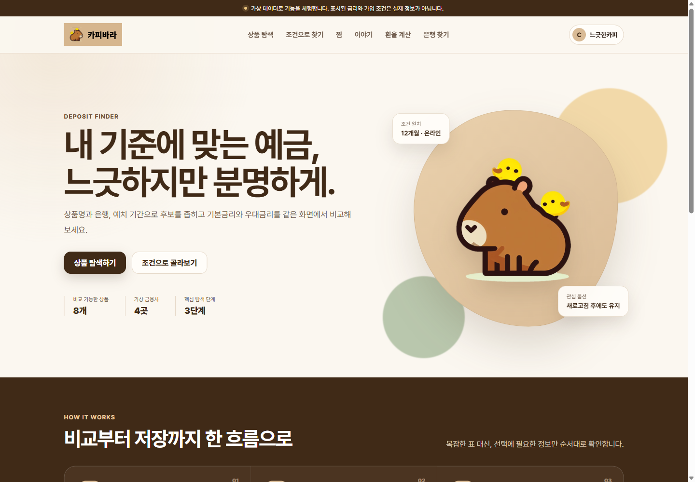
</p>

---

## 01. 프로젝트 개요

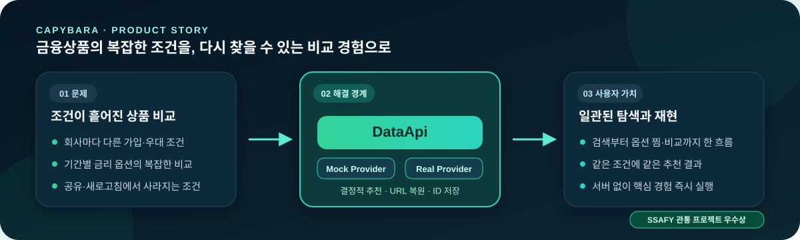

### 해결하려는 문제와 서비스

- **비교 문제** — 금융회사마다 다른 가입 대상·우대 조건·가입 방식·기간별 금리
- **통합 탐색** — 상품 검색, 조건 필터, 상세 옵션, 찜 비교의 단일 흐름
- **재현 가능한 후보** — 선호 기간·금리 기준·가입 방식에 따른 결정적 결과
- **상태 복원** — 검색·탐색 조건은 URL, 찜·가상 커뮤니티 변경은 브라우저 저장
- **데이터 범위** — 금융회사·상품·금리·환율·지점 모두 가상 데이터, 금융 추천·자격 판정·투자 조언 제외

### 프로젝트 정보

| 구분 | 내용 |
| --- | --- |
| 개발 기간 | 2023.11.15 ~ 2023.11.24 |
| 팀 규모 | 2명 |
| 제공 형태 | Web |
| 수상·성과 | 삼성청년SW아카데미 1학기 관통 프로젝트 우수상 · 2023.11.28 |

<p align="center">
  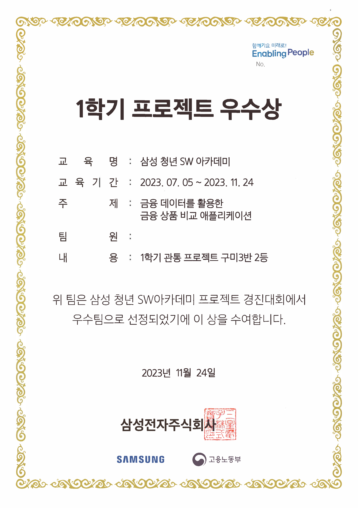
</p>

---

## 02. 팀과 기여

### 팀 구성과 담당 역할

<table width="100%">
  <tr>
    <td align="center" valign="middle" width="120">
      <a href="https://github.com/andongmin94">
        <br>
        <strong>andongmin94</strong>
      </a>
    </td>
    <td align="left" valign="middle">
      <strong>Backend · Data · Integration · Quality</strong><br><br>
      <sub><strong>도메인·DB</strong> — Django 도메인·DB 및 마이그레이션 설계</sub><br>
      <sub><strong>API</strong> — 인증·권한과 accounts·articles·finlife REST API</sub><br>
      <sub><strong>외부 데이터</strong> — 금융감독원 상품·옵션 수집 및 정합성 관리</sub><br>
      <sub><strong>실행 경계</strong> — 공통 DataApi와 Mock·Real 공급자 경계</sub><br>
      <sub><strong>품질</strong> — 결정적 추천, URL·저장 상태 복원, 회귀 테스트</sub>
    </td>
  </tr>
  <tr>
    <td align="center" valign="middle" width="120">
      <a href="https://github.com/jiyeon2536">
        <br>
        <strong>jiyeon2536</strong>
      </a>
    </td>
    <td align="left" valign="middle">
      <strong>Frontend · Vue UI · State · User Flow</strong><br><br>
      <sub><strong>화면</strong> — 홈·회원·커뮤니티·금융상품·추천 화면과 반응형 UI</sub><br>
      <sub><strong>라우팅·상태</strong> — Vue Router·Pinia 기반 라우팅과 상태 흐름</sub><br>
      <sub><strong>비교 경험</strong> — 옵션 찜·중복 제거·금리 비교 차트</sub><br>
      <sub><strong>사용자 경험</strong> — Kakao 지도·환율 계산·커뮤니티 사용자 경험</sub>
    </td>
  </tr>
</table>

### 담당 영역 및 구체적인 기여

#### 구현 소유 경계

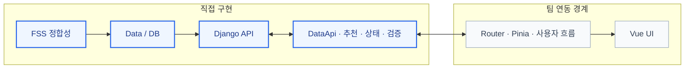

> 파란색: 직접 구현 · 회색: 팀 연동 경계

#### 핵심 구현

- User·Article·Comment·DepositProducts·DepositOptions 관계 설계, 마이그레이션과 ERD 기반 구성
- accounts·articles·finlife 도메인 분리, URL·view·serializer 계층 연결
- dj-rest-auth·TokenAuthentication 기반 회원가입·로그인·본인 프로필 조회·수정·탈퇴 구현
- 게시글·댓글 인증과 작성자 권한 검증, 중첩 사용자 응답을 id·username·nickname으로 제한
- 금융감독원 상품·옵션 분리, transaction·timeout·update_or_create·DB 제약 기반 수집·조회 API 구현
- Mock·Real 공급자의 단일 TypeScript DataApi 계약 통합
- 희망 기간·금리·가입 방식 점수화와 상품 코드 안정 정렬 기반 결정적 추천 구현
- URL 조건 복원, 상품 코드 직접 조회, 버전별 localStorage 키와 메모리 fallback 구현
- Mock·추천 단위 테스트, accounts·articles·finlife API 테스트, 환경변수 기반 실행 구성

---

## 03. 사용자 경험

### 대표 화면

| 상품 검색과 필터 | 조건 기반 상품 탐색 |
| --- | --- |
| 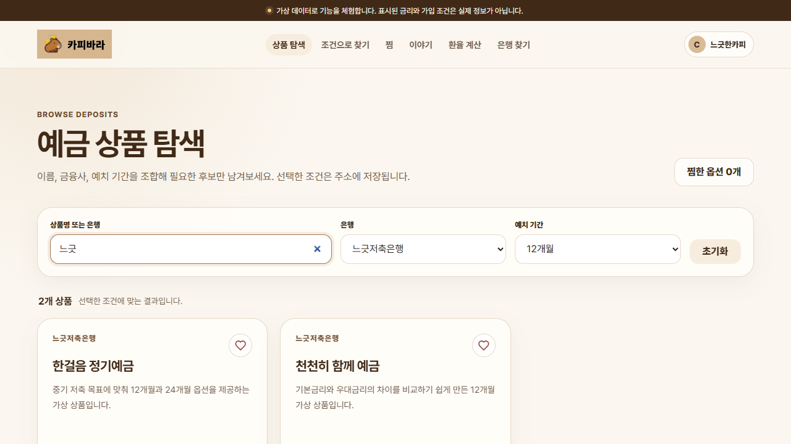 | 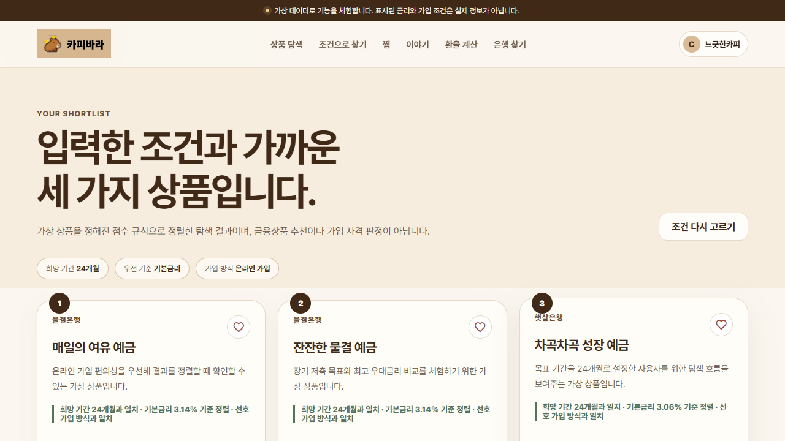 |
| 상품명·금융회사·가입 기간 조합과 URL 검색 상태 공유 | 선호 기간·비교 기준·가입 방식 기반 재현 가능한 탐색 |

| 상품 상세 | 찜한 옵션 비교 |
| --- | --- |
| 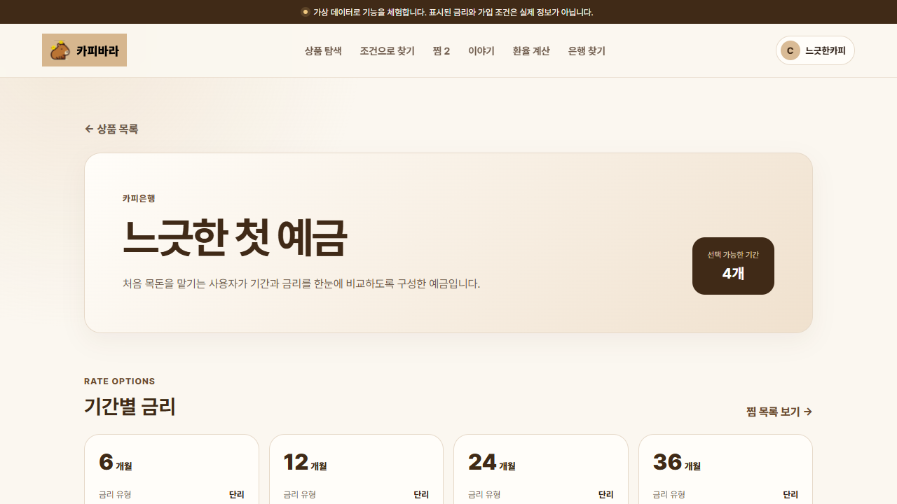 | 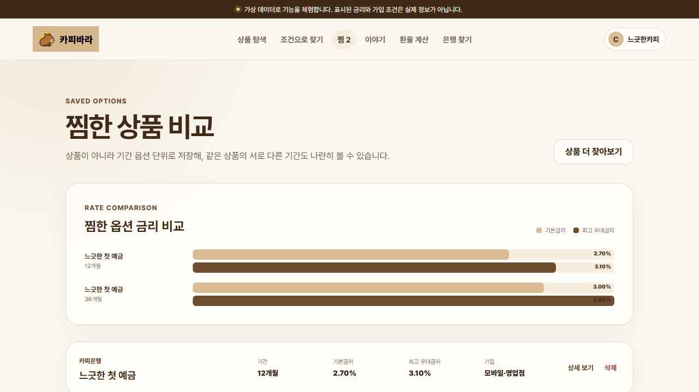 |
| 가입 대상·방법·우대 조건과 기간별 금리 확인 | 저장 옵션의 기본·최고 우대금리 차트·목록 비교 |

### 핵심 사용자 흐름

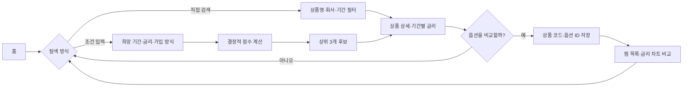

1. URL query 기반 검색어·금융회사·가입 기간과 화면 입력의 양방향 동기화
2. route 상품 코드 기반 상품·옵션 재조회와 직접 상세 접근
3. 희망 기간의 최근접 옵션 선택과 사용자 기준 점수 계산
4. 상품 코드·옵션 ID 저장 후 현재 데이터와 재결합
5. Mock의 무서버 재현 / Real의 동일 화면 계약 기반 Django API 호출

### 주요 기능

| 기능 | 사용자 경험 | 구현·데이터 흐름 |
| --- | --- | --- |
| 예금 상품 검색 | 상품명·금융회사 검색, 금융회사·기간 필터 | q, bank, term query로 복원 |
| 상품 상세 | 기간별 기본·최고 우대금리와 가입 조건 확인 | 상품 코드를 통한 직접 조회 |
| 조건 기반 탐색 | 기간·금리 기준·가입 방식으로 상위 3개 후보 확인 | 결정적 점수 계산과 상품 코드 안정 정렬 |
| 옵션 찜 비교 | 같은 상품의 서로 다른 기간도 개별 저장·삭제 | 모드와 버전을 구분한 localStorage 키 |
| 커뮤니티 | 게시글 목록·상세·작성, 댓글 작성·삭제 | Mock 브라우저 저장 또는 인증된 Django API |
| 환율 계산 | KRW, USD, JPY, EUR, CNY 간 금액 환산 | Mock 기준값 또는 Real 외부 환율 조회 |
| 은행 지점 찾기 | 지역·은행 필터와 가상 지도 확인 | Mock fixture 제공, Real 공급자는 미연결 |
| 계정 흐름 | 프로필·로그인·회원가입 화면 경험 | Mock 가상 사용자, Real 화면은 읽기 전용 |

---

## 04. 설계와 구현

### 전체 시스템 구조

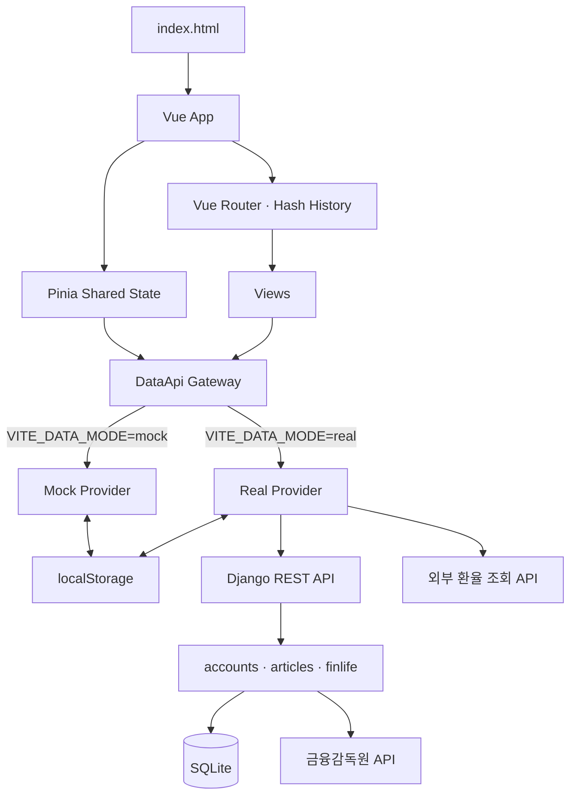

| 상태 | 기준 원본 | 지속 방식 |
| --- | --- | --- |
| 상품·옵션 | Mock fixture 또는 Django API | 화면 진입 시 다시 조회 |
| 검색어·금융회사·기간 | URL query | 링크·새로고침·뒤로 가기로 복원 |
| 현재 상품 | route의 상품 코드 | 상세 API로 재조회 |
| 찜한 옵션 | 상품 코드·옵션 ID | 모드·버전별 localStorage |
| 조건 탐색 | route query와 상품·옵션 | URL 복원 후 다시 계산 |
| 커뮤니티 변경 | Mock provider 또는 Django DB | 모드별 저장소 |

- **커뮤니티 관계** — 사용자와 게시글·댓글 연결, 상위 댓글 참조
- **금융상품 관계** — 상품과 기간별 옵션의 일대다 구성, 상품·공시월·금리 유형·기간 조합 중복 제한
- **찜 소유권** — 서버 모델이 아닌 브라우저 상태

### 핵심 기술 구현

#### 하나의 API 계약으로 Mock과 Real 전환

- **분기 위치** — 화면·store 외부의 단일 API 경계
- **공통 계약** — 상품·추천·찜·커뮤니티·환율·지점·현재 사용자 메서드를 정의한 DataApi
- **공급자 선택** — 앱 시작 시 Mock 또는 Real 하나를 선택
- **화면 재사용** — 무서버 기본 실행과 Django 연동의 동일 컴포넌트 흐름

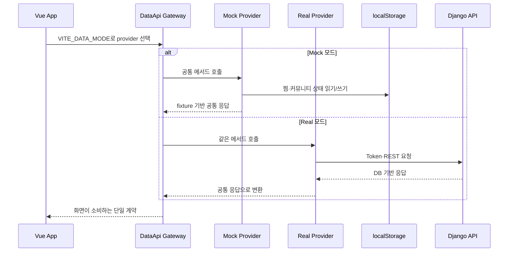

```ts
const activeSource = {
  mock: { api: mockApi, metadata: sourceMetadata.mock },
  real: { api: realApi, metadata: sourceMetadata.real },
}[requestedMode]
```

#### 같은 입력에 같은 결과를 내는 조건 탐색

- **평가 방식** — 무작위 추출 대신 상품별 최근접 기간 옵션 선택과 명시적 점수 합산

| 점수 항목 | 계산 |
| --- | --- |
| 기간 | 정확히 일치하면 600, 그 외에는 300 - 개월 차이 × 12 |
| 기본금리 우선 | 기본금리 × 100 |
| 최고 우대금리 우선 | 최고 우대금리 × 100 |
| 가입 편의 우선 | 온라인 가능 260, 영업점 가능 120 |
| 선호 가입 방식 | 선택 방식과 일치하면 180 |
| 가입 제한 | 제한 없음이면 30 |

- **옵션 동률 처리** — 최고 우대금리, 옵션 ID 순
- **상품 동률 처리** — 상품 코드 안정 정렬
- **산출물** — 상품, 선택 옵션, 점수, 화면용 근거 문구

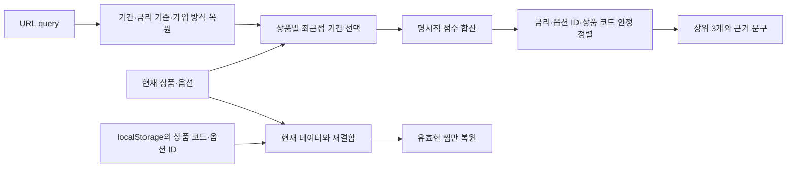

#### URL을 화면 상태의 기준으로 사용

- **상품 검색** — q·bank·term query 읽기와 입력 변경 반영
- **조건 탐색** — term·priority·channel query 기반 결과 재계산
- **상품 상세** — route 상품 코드 기반 직접 접근
- **정적 실행** — hash history·상대 asset base로 별도 rewrite 없이 하위 화면 접근

#### 작고 복구 가능한 브라우저 저장

- **최소 저장** — 상품 전체 대신 상품 코드·옵션 ID 기록
- **키 격리** — Mock·Real 모드와 스키마 버전 구분
- **손상 복구** — 잘못된 JSON 제거 후 초기값 적용
- **저장소 fallback** — localStorage 사용 불가 시 메모리 저장소

#### 외부 금융상품 수집과 권한 경계

- **수집 단위** — 금융감독원 상품 기본 정보와 기간별 옵션 분리
- **원자성** — transaction 내부 갱신
- **중복 방지** — DB 제약과 update_or_create 병행
- **권한 경계** — TokenAuthentication, 인증 사용자와 작성자 검증

### 기술적 의사결정과 해결한 문제

| 문제 | 선택한 방식 | 결과와 고려사항 |
| --- | --- | --- |
| 프로젝트 재현에 Django와 API 키가 필요함 | Mock/Real 공급자를 DataApi 뒤에 배치 | 기본 Mock 모드로 핵심 흐름을 즉시 재현, Real 기능 범위는 별도 표시 |
| 새로고침·공유 링크에서 검색 상태가 사라짐 | URL query를 검색 조건의 원본으로 사용 | 뒤로 가기와 직접 접근 복원, 화면 상태와 URL 동기화 필요 |
| 상세 화면이 이전 목록의 선택 객체에 의존함 | 상품 코드를 route에 넣고 다시 조회 | 직접 URL 접근 가능, Real 모드에서는 추가 조회 비용 발생 |
| 무작위 추천은 결과 근거와 재현성이 부족함 | 명시적 점수 규칙과 안정 정렬 적용 | 같은 입력에 같은 결과와 이유 제공, 금융 적합성 판단은 범위 밖 |
| 찜에 상품 전체를 저장하면 데이터가 오래됨 | 상품 코드와 옵션 ID만 저장 후 재결합 | 저장 크기와 stale 사본 감소, 삭제된 옵션은 표시에서 제외 |
| 브라우저 저장소가 차단되거나 JSON이 손상됨 | 메모리 fallback과 손상 값 초기화 | 앱 흐름 유지, 메모리 fallback은 새로고침 후 지속되지 않음 |
| 외부 수집 실패가 DB 일부 변경으로 이어질 수 있음 | HTTPS·timeout·transaction·오류 응답 적용 | 부분 저장을 방지하고 외부 오류를 일관된 API 응답으로 전달 |

### 기술 스택

| 구분 | 기술 |
| --- | --- |
| 현재 Frontend | Vue 3.5, TypeScript 5.9, Vite 8.1, Pinia 3.0, Vue Router 4.6, CSS |
| Backend | Python 3.11+, Django 5.2, Django REST Framework 3.17, dj-rest-auth, django-allauth |
| Data · Integration | SQLite, 금융감독원 금융상품 API, 외부 환율 조회 API, localStorage |
| Quality | ESLint 10, vue-tsc 3.3, Vitest 4.1, DRF APITestCase |
| 2023 Frontend 구현 | Vue 3, TypeScript, Vite, Pinia, Vue Router, Vuetify, Sass, Chart.js, vue3-charts |

### 주요 코드 탐색 가이드

| 살펴볼 영역 | 핵심 파일 | 확인할 내용 |
| --- | --- | --- |
| 앱 진입과 라우팅 | [`main.ts`](frontend/src/main.ts)<br>[`index.ts`](frontend/src/router/index.ts)<br>[`App.vue`](frontend/src/App.vue) | 앱 초기화, hash history, lazy route, 공통 navigation |
| API 모드 경계와 계약 | [`index.ts`](frontend/src/api/index.ts)<br>[`types.ts`](frontend/src/api/types.ts) | Mock/Real 선택, 화면이 공유하는 DataApi 타입 |
| Mock 데이터 흐름 | [`mock.ts`](frontend/src/api/mock.ts)<br>[`mockData.ts`](frontend/src/api/mockData.ts) | 가상 상품·커뮤니티·환율·지점과 브라우저 저장 |
| 추천과 저장 복원 | [`recommendation.ts`](frontend/src/api/recommendation.ts)<br>[`storage.ts`](frontend/src/api/storage.ts) | 결정적 점수 계산, localStorage fallback |
| Real API 연결 | [`real.ts`](frontend/src/api/real.ts) | Django endpoint, Token header, 외부 환율 요청 |
| 금융상품 화면 | [`InterestView.vue`](frontend/src/views/finances/InterestView.vue)<br>[`InterestDetailView.vue`](frontend/src/views/finances/InterestDetailView.vue)<br>[`CartView.vue`](frontend/src/views/finances/CartView.vue) | 검색 query, 직접 상세 조회, 옵션 찜과 차트 |
| 계정 도메인 | [`models.py`](backend/accounts/models.py)<br>[`serializers.py`](backend/accounts/serializers.py)<br>[`views.py`](backend/accounts/views.py) | 커스텀 사용자, 공개 필드, 본인 프로필 권한 |
| 커뮤니티 도메인 | [`models.py`](backend/articles/models.py)<br>[`serializers.py`](backend/articles/serializers.py)<br>[`views.py`](backend/articles/views.py) | 게시글·댓글 관계와 작성자 권한 |
| 금융상품 도메인 | [`models.py`](backend/finlife/models.py)<br>[`views.py`](backend/finlife/views.py) | 상품·옵션 모델, FSS 수집, 중복 방지 |
| 검증 코드 | [`mock.spec.ts`](frontend/src/api/__tests__/mock.spec.ts)<br>[`recommendation.spec.ts`](frontend/src/api/__tests__/recommendation.spec.ts)<br>[`accounts`](backend/accounts/tests.py)<br>[`articles`](backend/articles/tests.py)<br>[`finlife`](backend/finlife/tests.py) | 공급자 계약, 추천 재현성, 권한·외부 오류 처리 |

---

## 05. 실행과 검증

### 실행 방법

- **기본 실행** — 별도 서버와 API 키가 필요 없는 Mock 모드

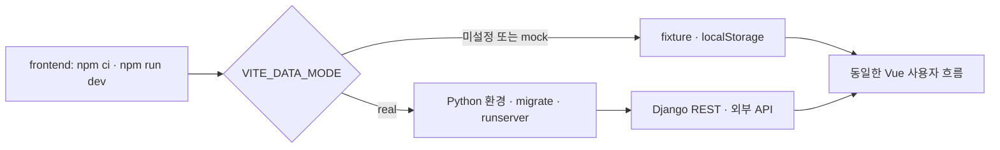

```bash
cd frontend
npm ci
npm run dev
```

- **접속** — `http://localhost:5173`
- **확인 범위** — 상품 검색·상세·조건 탐색·찜 비교·커뮤니티·환율·가상 지점

<details>
<summary>환경변수 및 Real 모드 실행 상세</summary>

#### 요구 환경

- Python 3.11 이상
- Node.js 20.19.x 또는 22.12 이상
- npm 10 이상
- 금융상품 수집을 실행할 때만 금융감독원 API 키

#### 환경변수

| 위치 | 변수 | 용도 |
| --- | --- | --- |
| frontend/.env | VITE_DATA_MODE | mock 또는 real 공급자 선택 |
| frontend/.env | VITE_API_BASE_URL | Django API 기준 URL |
| backend/.env | DJANGO_SECRET_KEY | Django secret, DEBUG=False에서 필수 |
| backend/.env | DEBUG | Django debug 모드 |
| backend/.env | ALLOWED_HOSTS | 쉼표로 구분한 허용 host |
| backend/.env | CORS_ALLOWED_ORIGINS | 쉼표로 구분한 프런트엔드 origin |
| backend/.env | FSS_API_KEY | 금융상품 수집 API 키 |
| backend/.env | FSS_API_TIMEOUT | 외부 수집 timeout 초 |

- **보안** — 예제 파일만 복사하고 실제 secret·운영 주소는 커밋 제외

```dotenv
VITE_DATA_MODE=real
VITE_API_BASE_URL=http://127.0.0.1:8000
```

```powershell
cd backend
python -m venv .venv
.\.venv\Scripts\Activate.ps1
python -m pip install -r requirements.txt
python manage.py migrate
python manage.py runserver
```

프런트엔드 별도 터미널 실행:

```bash
cd frontend
npm ci
npm run dev
```

- **Real 연결** — Django 상품·옵션·인증 커뮤니티, 외부 환율 API
- **미연결 범위** — Real 로그인 입력 화면, 실제 지점 공급자

</details>

### 검증 방법

- **Frontend** — 정적 분석, 타입 검사, 단위 테스트, production build
- **Backend** — Django system check, migration drift 검사, API 테스트

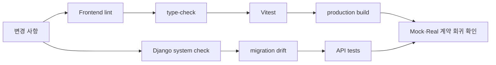

<details>
<summary>전체 검증 명령 보기</summary>

```bash
cd frontend
npm ci
npm run lint
npm run type-check
npm run test
npm run build
```

```bash
cd backend
python -m pip install -r requirements.txt
python manage.py check
python manage.py makemigrations --check --dry-run
python manage.py test
```

자동화 검증 범위:

- Mock 공급자의 무네트워크 실행과 Django 호환 핵심 응답 필드
- 공개 사용자 데이터의 id·username·nickname 제한
- 찜 추가·중복 제거·삭제와 가상 글·댓글 저장
- 동일 추천 조건의 순서·점수 재현성
- 프로필 본인 권한, 게시글·댓글 작성자 권한, 금융상품 수집 오류

</details>

### 프로젝트 범위와 현재 상태

`✅ 즉시 확인` · `△ 설정 필요` · `— 범위 제외`

| 상태 | 구분 | 확인 가능한 범위·제약 |
| :---: | --- | --- |
| ✅ | Mock 기본 실행 | 서버·외부 API 없이 검색·상세·조건 탐색·찜·가상 커뮤니티·환율·지점 실행 |
| ✅ | 데모 데이터 | 가상 금융회사·상품·금리·환율·지점, localStorage에 찜·커뮤니티 변경 유지 |
| △ | Real 연동 | Django 상품·옵션·커뮤니티와 외부 환율 연결. 계정 입력 UI·실제 지점 provider 미연결 |
| △ | 외부 의존성 | 금융상품 수집은 금융감독원 API 키, Real 커뮤니티는 Django 인증 토큰 필요 |
| ✅ | 탐색용 추천 | 기간·금리·가입 방식 비교. 금융 적합성·가입 가능 여부 판단 제외 |
| ✅ | 자동 검증 | Frontend API·추천 테스트, ESLint, 타입 검사, Vite 빌드, Django API 테스트 |
| — | 브라우저 E2E | 자동화 범위에서 제외 |

- **보존 범위** — 2023년 팀 프로젝트의 Vue·Django 구현
- **현재 범위** — 무서버 Mock 실행, 금융상품 도메인·API·실행 구조의 단일 저장소 재현
